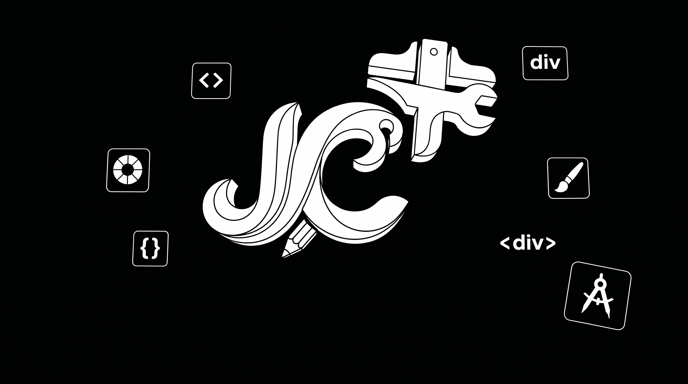

<div align="center">
  
  
  <h1 align="center">Just Creative Tools (JCT) 🎨</h1>

  <p align="center">
    <a href="https://github.com/vigneshwar-creates/No-BS-Just-Creative-Tools/stargazers"></a>
    <a href="https://github.com/vigneshwar-creates/No-BS-Just-Creative-Tools/issues"></a>
    <a href="https://github.com/vigneshwar-creates/No-BS-Just-Creative-Tools/network/members"></a>
    <a href="https://github.com/vigneshwar-creates/No-BS-Just-Creative-Tools/blob/main/LICENSE"></a>
  </p>
  
  <p>
    <b>Just Creative Tools</b> is a collection of super simple design tools.<br>
    Everything runs completely on your computer inside your web browser.<br>
    This means your files and photos are <b>100% safe</b>. They are never sent to any server or stored in the cloud.
  </p>
</div>

## Features 🎯

- [x] **Canvas Image & Text Editor**: Add photos, draw sketches, add text layers, and import custom fonts. Adjust brightness, contrast, saturation, and more.
- [x] **Portable .JCT Project Files**: Export your canvas workspace as a `.jct` file to back it up, share it, or import it later.
- [x] **Smart Image Resizer**: Resize your photo for any social media site or platform without weird cropping.
- [x] **Freehand & Shape Cropper**: Crop to standard sizes or draw a freehand line to cut out any shape.
- [x] **Webcam Photo Cropper**: Take a photo using your computer's webcam and crop it instantly.
- [x] **GIF Creator & Editor**: Make moving pictures (GIFs) and customize them with text overlays and fun emojis.
- [x] **Secure Local Storage**: All of your designs are securely saved on your device using your browser's local storage.

## How does it work? 💡

Unlike other design sites, JCT **does not upload your images**. It uses modern web technology inside your browser to do all the processing locally. This makes the tools extremely fast and completely private.

## Quick Start 🚀

1. Make sure you have **Node.js** installed on your computer.
2. Clone the repository and install dependencies:
   ```bash
   git clone https://github.com/vigneshwar-creates/No-BS-Just-Creative-Tools.git
   cd No-BS-Just-Creative-Tools
   npm install
   ```
3. Start the local server:
   ```bash
   npm run dev
   ```
4. Open the link shown in your terminal (usually `http://localhost:5173`) in your web browser.

## Built With 🛠️

- **[Vite + React](https://vitejs.dev/)** - For a lightning-fast and responsive interface.
- **[idb-keyval](https://github.com/jakearchibald/idb-keyval)** - For saving your progress locally in your browser's IndexedDB.
- **[Lucide React](https://lucide.dev/)** - For clean and simple icons.

<div align="center">
  <p>
    <sub>
      Built with ❤️ for a No-BS creative workflow.
    </sub>
  </p>
</div>
